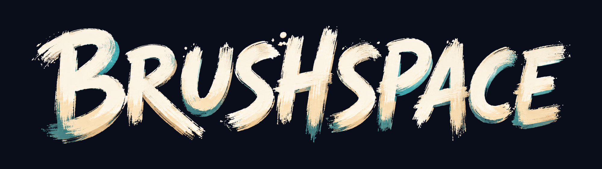

<p align="center">
  
</p>

<p align="center">
  <strong>Paint in thin air, together.</strong><br />
  A WebXR 3D painting app partially ported from <a href="https://openbrush.app/">Open Brush</a>
  and adapted for the web, built with the
  <a href="https://github.com/facebook/immersive-web-sdk">Immersive Web SDK</a>
  (<a href="https://iwsdk.dev">iwsdk.dev</a>) — no install required.
</p>

<p align="center">
  Live at <a href="https://brushspace.elixr.games">brushspace.elixr.games</a> — open it in a headset browser (Meta Quest) or any desktop browser.
</p>

---

## Features

- **The real brushes** — Open Brush's brush library rendered with the original
  shaders (audio-reactive ribbons, light, fire, smoke, and friends), ported to
  run as `RawShaderMaterial`s on WebGL.
- **Full painting kit** — free paint and straightedge tools, eraser, color
  wheel with favorites, dropper, brush size ring, undo/redo, and a camera tool
  for in-headset snapshots.
- **Sketches that persist** — save, browse, and reload sketches locally
  (IndexedDB), with thumbnails, `.tilt`-compatible documents, and GLB export.
- **Two-person collaboration** — host a sketch, speak a six-digit code, and
  paint together over peer-to-peer WebRTC: live stroke streaming, erase/undo
  sync, reconnect-and-merge after drops, and a painted bird-head avatar
  tracking your partner's headset.
- **Grab the world** — squeeze both grips to move, rotate, and scale the whole
  sketch around you.
- **Sound** — per-brush painting audio and the original UI sound set.

## Getting started

```bash
npm install
npm run dev
```

`npm run dev` starts the IWSDK dev server at `https://localhost:8081` with a
built-in WebXR emulator, so everything works in a plain desktop browser. On a
headset on the same network, open the LAN URL the server prints and tap
**Enter VR**.

Useful scripts:

| Command | What it does |
| --- | --- |
| `npm run dev` | Dev server + WebXR emulator |
| `npm test` | Unit tests (vitest) |
| `npm run check` | Typecheck + import/feature lint + tests |
| `npm run build` | Production build to `dist/` |

## Controls

| Input | Action |
| --- | --- |
| Trigger (brush hand) | Paint / click UI |
| Off-hand thumbstick left–right | Rotate the wand panel ring (tools, brushes, color) |
| A / B (wand hand: X / Y) | Undo / redo |
| Both grips | Grab the world — move, rotate, scale |
| Desktop: mouse drag | Paint |
| Desktop: `Space`/`B`, `Z`/`Y`, `[`/`]` | Paint, undo/redo, previous/next brush |

To paint together: **Tools → Share** shows a six-digit code; your partner
picks **Tools → Join** and types it on the keypad (or opens the app with
`?join=CODE`). Both sides keep the merged sketch if the connection drops.

## Project layout

```
src/
  index.ts        World.create() + system registration
  components/     Shared ECS components
  systems/        ECS systems (input, stroke authoring, panels, collab, ...)
  brushes/        Brush catalog, geometry, shader library + generated assets
  strokes/        Stroke authoring/erasing/picking logic
  sketch/         .tilt documents, persistence, playback, GLB export
  panels/         Wand panel UI logic (UIKit)
  tools/          Tool modes, poses, and intersections
  collab/         P2P wire protocol
  app/            Shell setup, settings, sounds
ui/               UIKitML panel markup (compiled by the vite plugin)
public/openbrush/ Brush shaders/textures, audio, intro sketch (see NOTICE)
scripts/          Asset extraction pipelines (generated output is committed)
```

The pure-logic folders are plain TypeScript with vitest coverage; the ECS
systems in `src/systems/` glue them to IWSDK.

## License

[Apache 2.0](LICENSE). Brushspace is partially ported from
[Open Brush](https://openbrush.app/) — the community continuation of Google's
[Tilt Brush](https://github.com/googlevr/tilt-brush) — and adapted for the
web; it bundles brushes, shaders, sounds, and the intro sketch derived from
those Apache-2.0 projects (see [NOTICE](NOTICE)). It is not affiliated with
or endorsed by Google or the Icosa Foundation.
